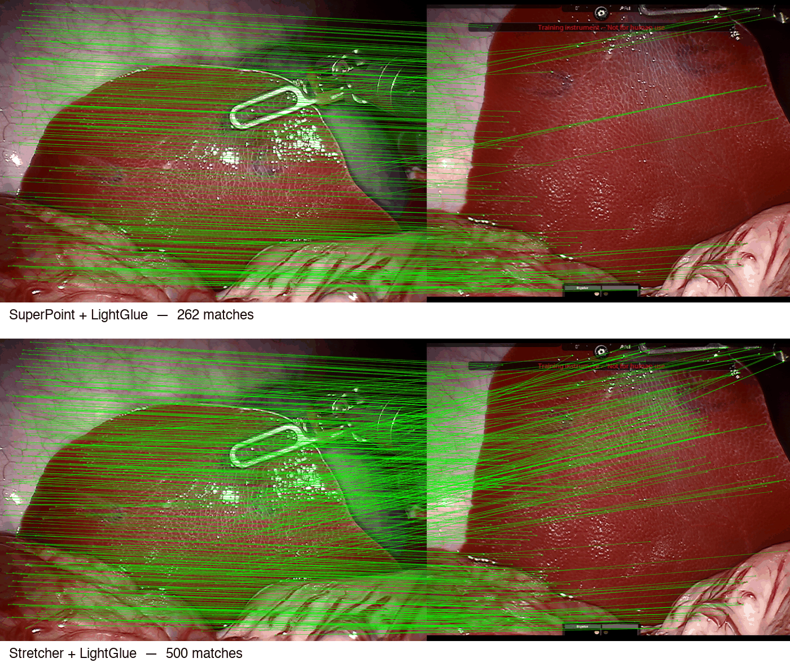

# Stretcher — Deformation-Robust Keypoint Descriptors

[](LICENSE)
[](environment.yml)
[](#citation)

Keypoint descriptors degrade badly when soft tissue stretches. **Stretcher** learns how a
descriptor *changes* under local affine strain and applies that transformation directly in
latent space — so a single keypoint can be matched against many deformation hypotheses
without ever recomputing image features.

Reference implementation for *Stretcher: A Learning-Based Framework for Deformation-Robust
Keypoint Descriptors* (von Witzleben & Haouchine).



---

## How it works

Standard test-time augmentation handles deformation by warping the image once per hypothesis
and re-extracting features — robust, but it costs a full forward pass per hypothesis and is
far too slow to use intraoperatively.

Stretcher replaces that loop with a learned map in descriptor space:

> **ρ(α, d) = d + Σᵢ MLPᵢ(α, d)**  &nbsp;&nbsp; (Eq. 1)

Given a descriptor `d` and local strain `α = (σx, σy, σxy)`, three small MLPs predict how the
descriptor would look had the patch been deformed. One SuperPoint pass then yields **125**
deformation-conditioned hypotheses per keypoint. Matching takes the best-scoring hypothesis
per pair, `M_ij = max_k ⟨dᵢ^{r,k}, dⱼ^d⟩`, and works unchanged with Dual Softmax or LightGlue.

Strain is parameterised co-rotationally: the deformation gradient `F = I + E` is split into a
rigid rotation and a pure stretch, so the learned transformation is not confounded by
rotation.

---

## Install

FEniCS is conda-only, so conda is the supported path:

```bash
conda env create -f environment.yml
conda activate stretcher
```

Built and tested on osx-arm64 (Apple Silicon). The file pins no platform-specific builds, so
it should also solve on linux-64 and osx-64 — untested. FEniCS 2019.1.0 has no Windows build;
use WSL2. For CUDA, install the matching torch wheel from
[pytorch.org](https://pytorch.org) after creating the environment.

On Apple Silicon, `PYTORCH_ENABLE_MPS_FALLBACK=1` is set automatically by the evaluation
script: DISK's detector calls `torch.kthvalue`, which has no MPS kernel and otherwise aborts.

If you only want to match real images and skip the FEM evaluation, `pip install -r
requirements.txt` is enough.

---

## Notebooks

Run them in order, or jump straight to either matching notebook — both work on a fresh clone,
using the images and weights included here.

| Notebook | What it does | Runs on a fresh clone |
|---|---|:---:|
| [`dataset_creation.ipynb`](dataset_creation.ipynb) | Build paired (rest, deformed) descriptors under the 125 affine modes | ✅ sample data |
| [`model_training.ipynb`](model_training.ipynb) | Train the descriptor transformation network | ✅ after the above |
| [`synthetic_matching.ipynb`](synthetic_matching.ipynb) | FEM-deformed liver, with ground-truth correspondences | ✅ |
| [`real_matching.ipynb`](real_matching.ipynb) | Real deformed pig liver image pair | ✅ |

`dataset_creation.ipynb` defaults to the few images shipped here so it runs immediately. The
released weights were trained on 694 **Cholec80** frames (hepatic sequences excluded and held
out for evaluation), which cannot be redistributed — see [Data](#data).

---

## Reproducing Table 1

```bash
python scripts/evaluate_table1.py                      # full table
python scripts/evaluate_table1.py --methods sp stretcher --matchers dsm
```

A liver image is deformed by a linear-elastic FEM model under four load cases. The
displacement field is known, so every match can be checked against ground truth. Results are
written to `results/` as CSV, Markdown and JSON.

Alongside precision and match count we report two strain-aware metrics, because a matcher that
finds many correspondences in near-rigid regions and none where tissue actually deforms is not
useful for navigation:

- **Entropy** — spread of local strain magnitude at correct matches. High means correct
  matches are distributed across deformation levels rather than clustered in stable regions.
- **SBP** (strain-balanced precision) — precision averaged over ten equally populated strain
  bins.

| Matcher | Method | Prec. (%) | Match Sc. (%) | # Matches | Entropy | SBP |
|:--|:--|--:|--:|--:|--:|--:|
| DSM | DISK | 24.84 ± 25.08 | 0.31 ± 0.31 | 16.25 ± 9.68 | 0.16 ± 0.17 | 0.09 ± 0.09 |
| DSM | ALIKED | 25.57 ± 23.78 | 17.66 ± 17.03 | 359.25 ± 55.03 | 0.60 ± 0.12 | 0.20 ± 0.18 |
| DSM | SuperPoint | 28.99 ± 13.11 | 12.90 ± 6.58 | 173.50 ± 31.57 | 0.87 ± 0.05 | 0.27 ± 0.12 |
| DSM | **Stretcher** | 43.10 ± 16.99 | 12.83 ± 5.55 | 117.00 ± 17.07 | 0.84 ± 0.08 | 0.40 ± 0.17 |
| LG | DISK | 71.07 ± 41.08 | 28.50 ± 19.64 | 614.00 ± 417.32 | 0.58 ± 0.34 | 0.59 ± 0.36 |
| LG | ALIKED | 94.75 ± 5.95 | 62.29 ± 20.08 | 405.00 ± 108.60 | 0.88 ± 0.04 | 0.88 ± 0.12 |
| LG | SuperPoint | 85.92 ± 10.70 | 23.71 ± 13.58 | 111.25 ± 67.05 | 0.80 ± 0.16 | 0.73 ± 0.23 |
| LG | **Stretcher** | 75.25 ± 11.78 | 37.56 ± 2.40 | 200.00 ± 0.00 | 0.91 ± 0.05 | 0.71 ± 0.15 |

Every row above was regenerated by `scripts/evaluate_table1.py` on this repository and matches
the published Table 1 to the last digit — including the Stretcher rows. The one difference is
the Stretcher + LightGlue match score, printed as `−` in the paper; see [Errata](#errata).

Under Dual Softmax, Stretcher gives the highest precision (43.10% vs 28.99% for SuperPoint)
and the highest strain-balanced precision (0.40 vs 0.27), with fewer total matches — it trades
match count for correspondences that survive in deformed regions. Under LightGlue it has the
highest entropy of any method (0.91), meaning its correct matches are the most evenly spread
across deformation severity.

Values are mean ± std over the four load cases. Measured wall time on an M-series Mac: the
four Dual Softmax rows take **23s** and the three LightGlue baselines **68s**, while
Stretcher + LightGlue alone takes **1h 56m** — see [Limitations](#limitations) for why. Run
the fast rows on their own with `--matchers dsm`; results merge across invocations, so the
slow row can be added later.

---

## Errata

Reproducing this repository surfaced places where the published paper and the code that
produced its results disagree. The code is authoritative — it is what generated the released
weights and every reported number — so it is left unchanged and the discrepancies are recorded
here.

| Paper | Says | Implementation | Where |
|---|---|---|---|
| Sec. 2.3.1 | σx, σy ∈ {−1, −0.5, 0, 0.5, 1} | **{−0.5, −0.25, 0, 0.5, 1}** | [`generate_strain_tensors`](src/affine_transformations.py) |
| Sec. 2.2.1 | QR decomposition `F = RS` | **SVD-based polar decomposition** | [`polar_decomposition`](src/affine_transformations.py) |

The shear discretisation {−0.4, −0.2, 0, 0.2, 0.4} matches the paper. Polar and QR both
separate a rigid rotation from a co-rotated stretch and are equivalent for these deformations;
polar is the standard choice in co-rotational FEM.

Three further notes on reproducibility:

- Table 1 reports `−` for the Stretcher + LightGlue match score. That cell was produced by code
  that called `len()` on a batched tensor, yielding `1` instead of the keypoint count. The
  corrected value is computed above.
- The `200.0 ± 0.0` match count on the same row is a hardcoded top-200 cap on scored matches,
  exposed here as `--lg-topk`.
- `model_training.ipynb` implements Eq. 2 (mean squared error). The released checkpoint was
  produced by an earlier revision of the training code, so retraining is not expected to
  reproduce it bit-for-bit — which is why the notebook writes to a separate
  `models/stretcher_retrained.pth` rather than overwriting the released weights.

---

## Data

| Included | |
|---|---|
| `data/medical_deformed/` | Pig liver images — one for FEM deformation, one rest/deformed pair (MIT) |
| `models/stretcher_superpoint.pth` | Released Stretcher weights (SuperPoint backbone, 256-d) |

**Cholec80** (training) is not redistributable. Request it from
[CAMMA](http://camma.u-strasbg.fr/datasets), extract frames to `data/medical_training_data`,
and point `dataset_creation.ipynb` there.

---

## Limitations

- Deformation is modelled as **locally affine** — a first-order approximation. Strongly
  non-affine local motion (cutting, tearing) is outside the model, though a grid of local
  affine hypotheses covers much of it in practice.
- The hypothesis grid is **fixed at 125 modes**; strain beyond its range is not represented.
- Quantitative evaluation uses **synthetic FEM deformation** of real surgical images. Real
  surgical results are qualitative, since dense ground-truth correspondences under real tissue
  deformation are unavailable.
- The **LightGlue path is not optimised**. It runs the matcher once per hypothesis, and costs
  more than that alone implies: LightGlue exits early once confident, but Stretcher's
  hypotheses keep confidence low, so the full layer stack runs almost every time — 3.1s per
  pass against 0.15s on unmodified descriptors, roughly 21× slower. Most of the 125
  hypotheses are a poor fit for any given keypoint, exactly the regime early exit cannot
  help. Batching hypotheses or pre-filtering them per keypoint would address it. The Dual
  Softmax path does not have this problem and runs in seconds.
- Trained and evaluated on **laparoscopic liver imagery**; transfer to other tissue or
  modalities is untested.

---

## Repository layout

```
src/
  affine_transformations.py   local affine strain model, co-rotated warping   (Sec. 2.2.1)
  models.py                   TripleNet, the descriptor transformation network (Sec. 2.2.2)
  descriptors.py              SuperPoint detection and dense descriptor sampling
  dsm_matching.py             dual-softmax matching over deformation hypotheses (Sec. 2.1)
  fenics_deformation.py       FEM synthetic deformation, ground-truth tracking
  matching_util.py            drawing helpers, entropy and strain-balanced precision
  notebook_utils.py           the high-level steps the notebooks call
scripts/
  evaluate_table1.py          reproduces Table 1
  make_readme_figure.py       regenerates the figure above
```

---

## Citation

```bibtex
@article{vonwitzleben2026stretcher,
  title   = {Stretcher: A Learning-Based Framework for Deformation-Robust Keypoint Descriptors},
  author  = {von Witzleben, Constantin and Haouchine, Nazim},
  journal = {International Journal of Computer Assisted Radiology and Surgery},
  year    = {2026}
}
```

---

## License

Stretcher is released under the [MIT License](LICENSE).

Vendored third-party code keeps its own license — see [THIRD_PARTY.md](THIRD_PARTY.md).
**Note:** `lightglue/superpoint.py` retains Magic Leap's copyright banner and is restricted to
non-commercial research use. The MIT license here does not extend to it.

## Acknowledgements

Built on [SuperPoint](https://github.com/magicleap/SuperPointPretrainedNetwork),
[LightGlue](https://github.com/cvg/LightGlue), [DeDoDe](https://github.com/Parskatt/DeDoDe)
and [FEniCS](https://fenicsproject.org). Real surgical imagery from the
[DejaVu](https://doi.org/10.1007/978-3-319-66185-8_59) dataset and Cholec80.

Supported in part by the National Institutes of Health under grant K25EB035166.
